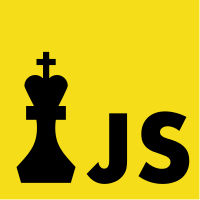

# chess.js

[](https://github.com/jhlywa/chess.js/actions)
[](https://www.npmjs.com/package/chess.js)
[](https://www.npmjs.com/package/chess.js)

chess.js is a TypeScript chess library used for chess move
generation/validation, piece placement/movement, and check/checkmate/stalemate
detection - basically everything but the AI.

chess.js has been extensively tested in node.js and most modern browsers.

## Documentation

This README provides a quick example, full documentation can be found at
[https://jhlywa.github.io/chess.js](https://jhlywa.github.io/chess.js).

## Installation

Run the following command to install the most recent version of chess.js from
NPM:

```sh
npm install chess.js
```

## Example Code

The code below plays a random game of chess:

```ts
import { Chess } from 'chess.js'

const chess = new Chess()

while (!chess.isGameOver()) {
  const moves = chess.moves()
  const move = moves[Math.floor(Math.random() * moves.length)]
  chess.move(move)
}
console.log(chess.pgn())
```

## Contributing

If you have any questions, suggestions, or find any bugs please open an issue.
PRs are very welcome too, please read the [Contributing Guide](CONTRIBUTING.md)
first to help make it a smooth process.
Edited by [David] as a GitHub learning exercise.